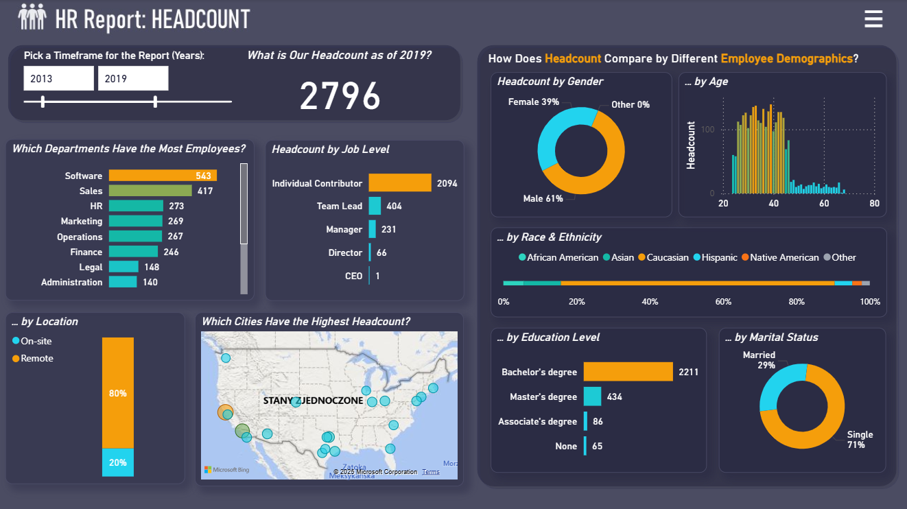
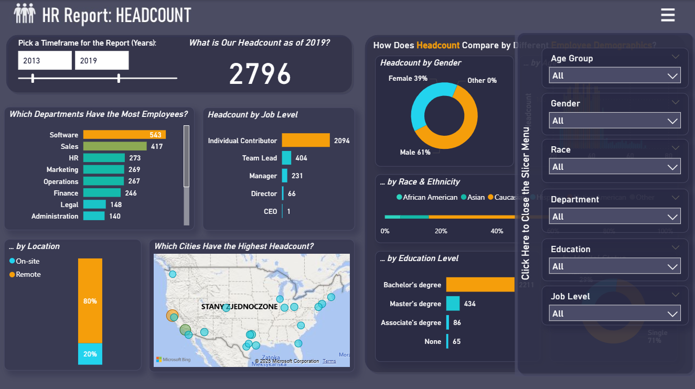
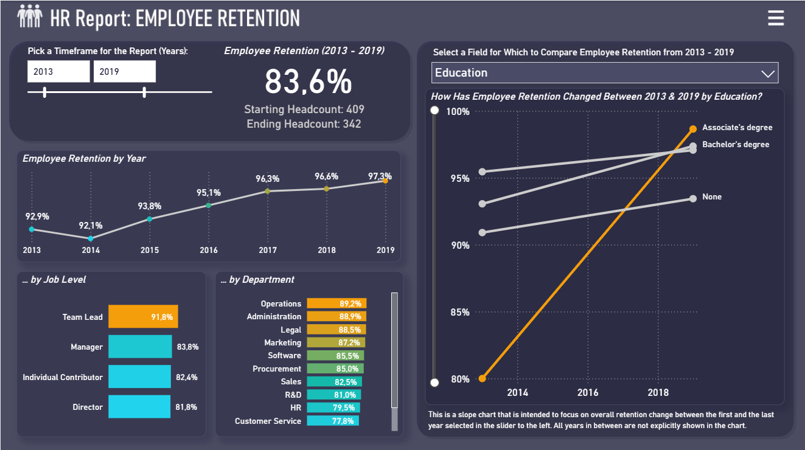
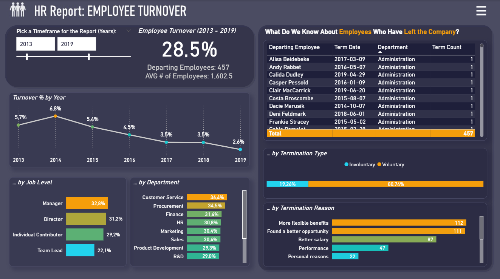
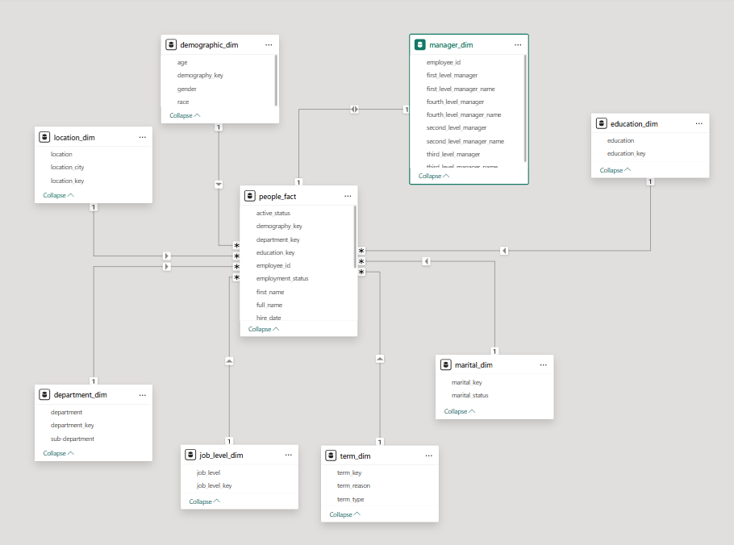

# 📊 HR Analytics Report (Power BI)

## 🧭 Overview
This project presents an **HR Analytics Dashboard** built in **Power BI**, designed to demonstrate skills in **data modeling**, **data transformation**, and **interactive reporting**.  
The report provides a clear overview of the company’s workforce structure, demographics, and attrition trends, supporting data-driven HR decision-making.

> 🧪 **Note:** The dataset used in this project is **artificial** and was created solely for the purpose of demonstrating report creation and analytical modeling skills.  
> It does **not** include any real or confidential employee information.

---

## 🎯 Project Motivation
The goal of this project was to create a **complete end-to-end Power BI report** that showcases:
- Proficiency in designing an analytical **data model** (star schema).  
- Competence in using **Power Query** for data cleaning and transformation.  
- Ability to build **interactive dashboards** that deliver clear, actionable insights.  

This HR-themed dataset was chosen because it provides meaningful metrics—such as headcount, attrition, and demographics—that reflect real-world HR analysis scenarios while remaining synthetic and safe for public sharing.

---

## 🗂️ Project Files

| File | Description |
|------|--------------|
| `HR_report.pbix` | Main Power BI report containing the data model, measures, and visuals. |
| `people_data.csv` | Employee-level dataset with demographic and organizational details. |
| `people_employment_history.csv` | Historical data capturing changes in employment and job status. |
| `Dates.xlsx` | Date dimension table used for time-based analysis. |
| `HR_report-data_model.png` | Data model diagram used in the Power BI report. |

---

## 🖼️ Report Previews

Below are sample pages from the Power BI HR Analytics Report, giving an overview of the key dashboards and insights included in the project.

### **1. Headcount Dashboard**
Displays total headcount, demographic composition, and location-based workforce distribution.

### **2. Headcount (Slicer Menu View)**
Interactive slicer-enabled view allowing users to filter by gender, age, education, and department.

### **3. Employee Retention**
Visualizes workforce stability with breakdowns by department, education, and job level.

### **2. Employee Turnover**
Highlights turnover trends and termination details, categorized by reason, department, and type.

---

## 🧠 Data Model Design

The model is built using a **star schema** for performance and clarity.  
At its center is the **`people_fact`** table, connected to several dimension tables describing employees’ demographics, departments, job levels, and employment details.

### 🔸 Fact Table
- **`people_fact`** – Core dataset containing employee records, hire dates, employment status, and foreign keys linking to dimension tables.

### 🔹 Dimension Tables

| Table | Description |
|--------|--------------|
| `demographic_dim` | Employee demographics such as age, gender, and race. |
| `education_dim` | Highest level of education achieved. |
| `location_dim` | Office or regional location information. |
| `department_dim` | Department and sub-department structure. |
| `job_level_dim` | Job levels or grades within the company. |
| `manager_dim` | Manager hierarchy up to four levels. |
| `marital_dim` | Marital status of employees. |
| `term_dim` | Termination types and reasons, used for attrition analysis. |

This structure enables flexible analysis of workforce composition and trends — such as **headcount by department**, **attrition by reason**, or **gender distribution across locations**.

---

## 🧾 Data Model Diagram

Below is the data model used in the Power BI report:

---

## ⚙️ Data Modeling Process

### 1️⃣ Data Preparation
- Imported raw data from `.csv` and `.xlsx` sources into Power BI.  
- Cleaned and formatted fields using **Power Query**, including renaming columns, fixing data types, and standardizing categorical values.  
- Added surrogate keys to define consistent relationships between tables.

### 2️⃣ Data Model Development
- Established one-to-many relationships between the `people_fact` table and dimension tables.  
- Implemented a **star schema** for optimized analytical performance.  
- Marked the `Dates` table as a **Date Table** to enable time-intelligence calculations.

### 3️⃣ DAX Measures
Developed DAX calculations for key HR metrics, including:
- **Headcount** – Total number of active employees.  
- **Attrition Rate** – Percentage of employees who have left the company within a given period.  
- **Employee Status Breakdown** – Active vs. terminated employees.  
- **Headcount by Department / Location / Education Level.**

---

## 📊 Key Insights in the Report
- Workforce distribution by **department**, **job level**, **education**, and **location**.  
- **Gender and age demographics** across the organization.  
- **Attrition analysis** by reason, department, and time period.  
- Overview of **managerial hierarchy** and reporting structure.

---

## 🛠️ Tools & Technologies

| Tool | Purpose |
|------|----------|
| **Power BI Desktop** | Data modeling, report design, and visualization |
| **Power Query (M)** | Data transformation and cleaning |
| **DAX** | Measures and KPI calculations |
| **Excel / CSV** | Source data format |
| **Star Schema** | Analytical data model design principle |

---

## 🚀 How to Use

1. Clone or download this repository.  
2. Open the `HR_report.pbix` file in **Power BI Desktop**.  
3. If prompted, connect to the local data sources (`people_data.csv`, `people_employment_history.csv`, and `Dates.xlsx`).  
4. Click **Refresh** to load and process the data.  
5. Explore interactive visuals and slicers to analyze HR metrics.

---

## 👩‍💼 Author

**Marta Gajewska**  
*Data Analyst | Power BI Developer*  
📧 gajewska.marta16@gmail.com  
🔗 [LinkedIn](https://www.linkedin.com/in/marta-gajewska-43057a19a/) 

