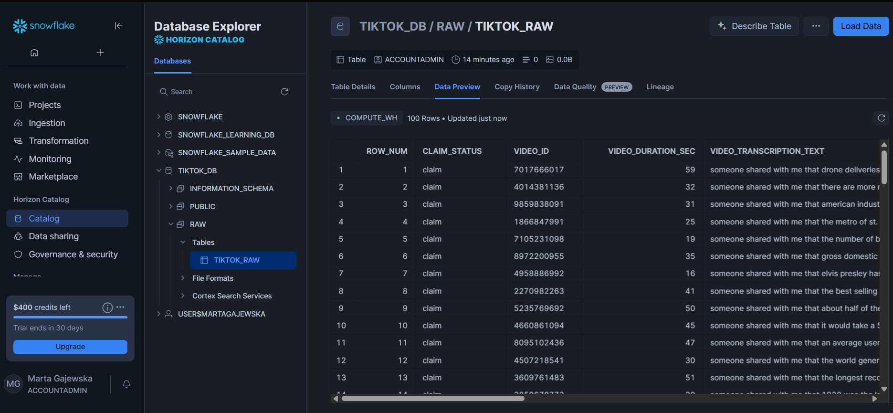
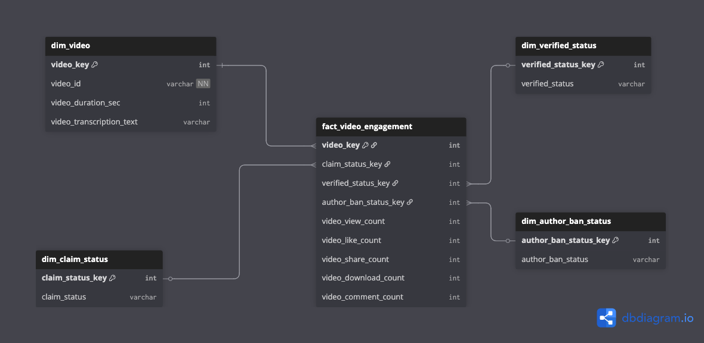
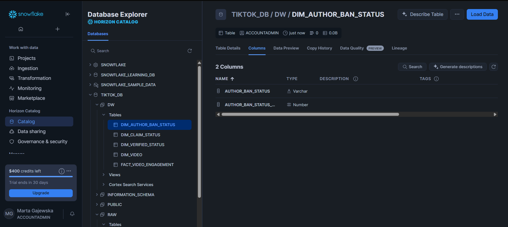
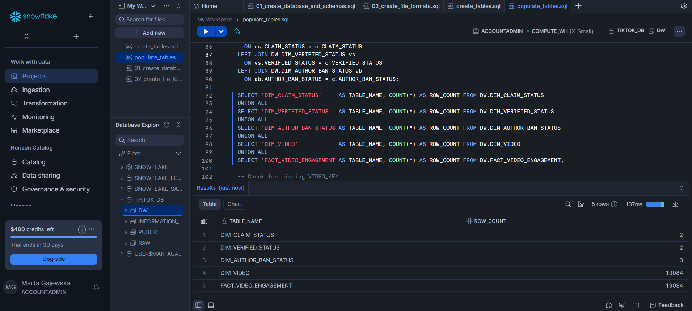
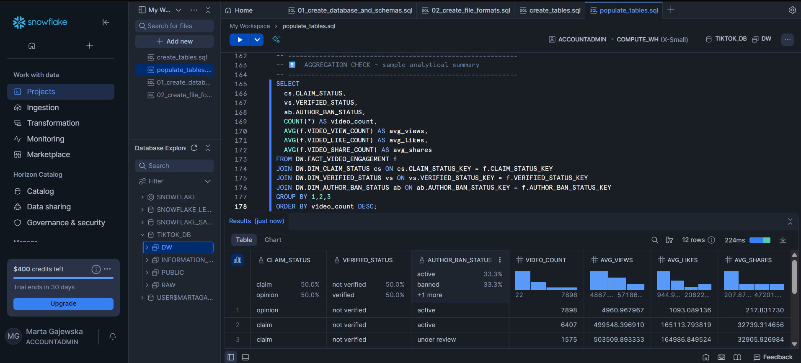
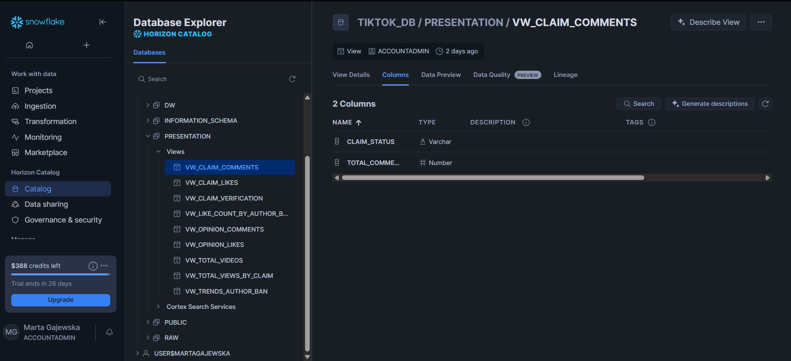

# 🎥 TikTok Analytics Report (Snowflake + Power BI)

## 🧭 Overview
This project presents a **TikTok Analytics Dashboard** built using **Snowflake** for data warehousing and **Power BI** for reporting.  
It demonstrates end-to-end data engineering and analytics skills — from **data ingestion**, **data modeling (star schema)**, and **SQL transformations**, to **interactive dashboarding**.

> 🧪 **Note:** The dataset used in this project is **artificial** and was created solely for educational purposes.  
> It does **not** include any real user data or confidential information.

---

## 🎯 Project Motivation
The goal of this project was to design a **complete modern analytics pipeline**, integrating:
- A **Snowflake-based data warehouse** for efficient data storage and transformations.  
- A **star schema** model optimized for Power BI analytics.  
- A **Power BI dashboard** presenting insights on video engagement, claim status, and author characteristics.

This project follows real-world data engineering principles — building from raw ingestion through curated layers to a presentation layer ready for business intelligence tools.

---

## 🗂️ Project Files

| File | Description |
|------|--------------|
| `01_create_database_and_schemas.sql` | Initializes database (`TIKTOK_DB`) and schemas (`RAW`, `DW`, `PRESENTATION`). |
| `02_create_file_formats_and_stages.sql` | Defines Snowflake file formats and stages for data loading. |
| `03_create_star_schema.sql` | Builds fact and dimension tables for the analytical data model. |
| `04_load_star_schema.sql` | Loads, merges, and validates data across the data warehouse tables. |
| `05_create_presentation_views.sql` | Creates analytical views used by Power BI. |
| `visuals/TIKTOK_RAW.png` | Screenshot of the raw data table in Snowflake. |
| `visuals/star_schema.png` | Entity-relationship diagram of the final star schema. |
| `visuals/DW_tables.png` | Screenshot showing dimension and fact tables populated in the `DW` schema. |
| `visuals/validation_results.png` | Example of validation queries and results in Snowflake. |
| `visuals/sample_aggregation.png` | Analytical summary query showing aggregated results by status. |
| `TikTok_report.pbix` | *(To be added)* Final Power BI dashboard file. |

---

## 🖼️ Data Pipeline Overview

### **1. Raw Data (Snowflake – RAW schema)**
The initial dataset `TIKTOK_RAW` contains video-level information such as:
- `CLAIM_STATUS`  
- `VIDEO_ID`  
- `VIDEO_DURATION_SEC`  
- `VIDEO_TRANSCRIPTION_TEXT`  

---

### **2. Data Warehouse Layer (Snowflake – DW schema)**
Transformed data is modeled into a **star schema**, consisting of:
- One **fact table**: `FACT_VIDEO_ENGAGEMENT`  
- Four **dimension tables**: `DIM_VIDEO`, `DIM_CLAIM_STATUS`, `DIM_VERIFIED_STATUS`, and `DIM_AUTHOR_BAN_STATUS`

Each dimension describes a different context of a video:
| Dimension | Description |
|------------|--------------|
| `DIM_VIDEO` | Contains unique video identifiers, duration, and transcription text. |
| `DIM_CLAIM_STATUS` | Categorizes videos as *claim* or *opinion*. |
| `DIM_VERIFIED_STATUS` | Indicates whether the author is verified. |
| `DIM_AUTHOR_BAN_STATUS` | Shows whether the author is active, banned, or under review. |

Fact table measures engagement metrics such as:
- `VIDEO_VIEW_COUNT`
- `VIDEO_LIKE_COUNT`
- `VIDEO_SHARE_COUNT`
- `VIDEO_COMMENT_COUNT`
- `VIDEO_DOWNLOAD_COUNT`

---

### **3. Data Validation**
Validation steps ensure data integrity before exposing it to Power BI.  
Key checks include:
- ✅ Row counts per table  
- ✅ Referential integrity (no missing foreign keys)  
- ✅ Uniqueness of natural keys  
- ✅ Sanity checks for negative or null values  

Sample analytical validation:

---

## 4. Presentation Layer (Snowflake – `PRESENTATION` Schema)

To feed Power BI with clean, analysis-ready data, the project exposes a set of **read-only views** in the `PRESENTATION` schema.  
These views **aggregate and simplify metrics** from the DW star schema, ensuring that the BI layer requires little to no transformation.

### Views Provided

| View Name | Description |
|------------|-------------|
| `VW_TOTAL_VIDEOS` | Total number of unique videos. |
| `VW_TOTAL_VIEWS_BY_CLAIM` | Total view count and video count by claim status. |
| `VW_TRENDS_AUTHOR_BAN` | Counts of videos by claim status × author ban status. |
| `VW_CLAIM_VERIFICATION` | Counts of videos by claim status × verification status. |
| `VW_LIKE_COUNT_BY_AUTHOR_BAN` | Raw like values by author ban status (for histogram binning). |
| `VW_OPINION_LIKES` / `VW_CLAIM_LIKES` | Total likes for opinion / claim videos. |
| `VW_OPINION_COMMENTS` / `VW_CLAIM_COMMENTS` | Total comments for opinion / claim videos. |

---

📌 **Power BI Integration:**  
Power BI connects directly to these views (**Import mode recommended**) to build visuals **without additional DAX measures**, if preferred.

---

## 🧠 Power BI Report Overview *(Placeholder)*
> 🔧 The Power BI report connects directly to the **Snowflake PRESENTATION schema** and visualizes insights across engagement, author verification, and claim types.  
 

---

## ⚙️ Data Modeling Process

### 1️⃣ Data Preparation
- Loaded raw TikTok dataset into Snowflake (`RAW.TIKTOK_RAW`).  
- Cleaned and standardized categorical fields.  
- Created database, schemas, and stages for ETL flow.

### 2️⃣ Data Warehouse Modeling
- Built dimension and fact tables using `CREATE TABLE` statements.  
- Populated them using `MERGE` operations from the cleaned data view.  
- Verified referential integrity and data consistency.

### 3️⃣ Presentation Layer
- Created a dedicated `PRESENTATION` schema with analytical views such as:
  - `VW_TOTAL_VIDEOS`
  - `VW_TOTAL_VIEWS_BY_CLAIM`
  - `VW_TRENDS_AUTHOR_BAN`
  - `VW_CLAIM_VERIFICATION`
- These are optimized for Power BI import and direct visualization.

---

## 🛠️ Tools & Technologies

| Tool | Purpose |
|------|----------|
| **Snowflake** | Cloud data warehouse for storage and SQL transformations |
| **SQL** | Data modeling, cleansing, and ETL processing |
| **Power BI** | Dashboard creation and visualization |
| **dbdiagram.io** | Entity-relationship diagram (star schema) |

---

## 🚀 How to Reproduce

1. Run the SQL scripts sequentially (`01` → `05`) in Snowflake.  
2. Verify that the `DW` and `PRESENTATION` schemas contain populated tables and views.  
3. Connect Power BI to your Snowflake instance.  
4. Import views from the `PRESENTATION` schema.  
5. Build visuals according to the planned dashboard layout.  

---

## 👩‍💼 Author

**Marta Gajewska**  
*Data Analyst | Power BI & SQL Developer*  
📧 gajewska.marta16@gmail.com  
🔗 [LinkedIn](https://www.linkedin.com/in/marta-gajewska-43057a19a/)

